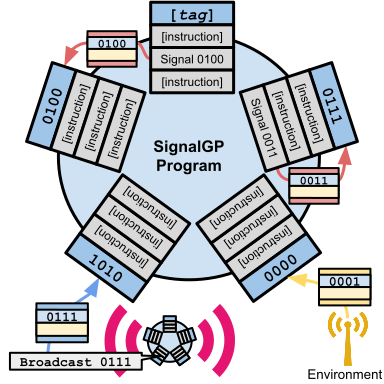
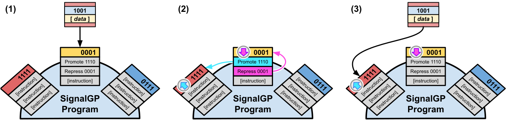

## Overview

**Navigation**

<!-- TOC -->

- [Overview](#overview)
  - [Contributing authors](#contributing-authors)
  - [Abstract](#abstract)
  - [SignalGP](#signalgp)
  - [Genetic Regulation in SignalGP](#genetic-regulation-in-signalgp)
  - [Experiments](#experiments)
  - [Results](#results)
- [Reproducibility](#reproducibility)
- [Supplemental Material](#supplemental-material)
- [References](#references)

<!-- /TOC -->

This repository is a companion to our 2020 ALife conference submission, Genetic Regulation Facilitates
the Evolution of Signal-response Plasticity in Digital Organisms.

### Contributing authors

- [Alexander Lalejini](https://lalejini.com/)
- [Matthew Andrew Moreno](http://mmore500.com/)
- [Charles Ofria](https://ofria.com/)

### Abstract

> In digital evolution, self-replicating computer programs (digital organisms) mutate, compete, and evolve _in silico_.
  Traditional forms of digital organisms execute procedurally, starting at the top of their program (genome) and proceeding in sequence.
  SignalGP (Signal-driven Genetic Programs) allows digital organisms to automatically respond to signals from the environment or other agents in a biologically-inspired manner.
  We augment SignalGP with genetic regulation, allowing organisms to dynamically adjust their response to signals during their lifetime.
  We demonstrate that this capacity for arbitrary gene regulatory networks facilitates the evolution of signal-response plasticity in digital organisms on simple diagnostic tasks.
  We find that more challenging diagnostic environments select for larger, more interconnected regulatory networks.
  We also observe that when signal-response plasticity is not required, erroneous regulation can manifest as maladaptive cryptic variation, impeding task generalization.
  In addition to exploring the effects of regulation on well-understood tasks, we evaluate whether digital organisms evolve to functionally incorporate genetic regulation in a less-prescribed domain where
  fraternal transitions in individuality can evolve _de novo_.
  We identify several multicellular lineages that adaptively employ genetic regulation and demonstrate that genetic regulation can enable evolved mechanisms for mutual exclusion.
  As SignalGP digital organisms become more lifelike, we broaden digital evolution's repertoire of experimental possibilities, allowing us to engage in more realistic studies of evolutionary dynamics.

### SignalGP

<!--  -->

  

SignalGP is a genetic program representation that allows digital organisms to dynamically react to
signals from the environment or from other agents.
In traditional digital organisms, programs comprise linear instruction sequences that are executed
procedurally: instructions are processed one at a time in a single chain of execution, and instructions
must explicitly check for new sensory information.
As such, these forms of traditional digital organisms must generate explicit queries to identify (and
respond to) changes in their environment.

In SignalGP, program expression is signal-driven.
Programs are segmented into genetic modules (or functions), and each module can be independently triggered
in response to a signal.
Each module associates a tag with a linear sequence of instructions.
Tags are labels that can mutate and evolve, and the similarity (or dissimilarity) between any two tags
can be computed.
In this work, tags are represented as fixed-length bit strings, and we compute the similarity, or match-score,
between any two tags using the streak metric (Downing, 2015).

SignalGP makes the concept of events or signals explicit: all signals contain a tag and any associated
data.
Signals can originate exogenously (e.g, from the environment or other agents) or endogenously (e.g., self-signaling).
We use tag-based referencing (Spector et al., 2011) to determine the most appropriate function to automatically trigger in
response to a signal.
Signals trigger the function with the closest matching tag.

For a more detailed description of the SignalGP representation (albeit in more of a evolutionary computation/
genetic programming vein), see [(Lalejini and Ofria, 2018)](https://doi.org/10.1145/3205455.3205523).

### Genetic Regulation in SignalGP

In this work, we augment the SignalGP representation with genetic regulation, allowing digital organisms
to alter their responses to signals during their lifetime.
We supplement the SignalGP instruction set with promotor and repressor instructions, which, when executed, adjust how well subsequent signals match with a target function (instruction-level tags and tag-based referencing are used for function targeting).

A simple example of how genetic regulation works is given in the figure below. First (1), an event triggers the yellow function that, when executed, (2) promotes the red function and represses itself. Finally (3), when a subsequent signal (identical to the previous) is received, it triggers the up-regulated red function instead of the yellow function.

### Experiments

We used several [diagnostic tasks](./documents/task-descriptions.md) to explore how genetic regulation faculties contribute to, and potentially detract from, the functionality of evolved SignalGP digital organisms.
Additionally, we investigate whether genetic regulation is functionally incorporated into digital multicellular organisms evolved in the [DISHTINY artificial life platform](https://github.com/mmore500/dishtiny) (Moreno and Ofria, 2019).

### Results

- We find that genetic regulation readily facilitates the evolution of signal-response plasticity in tasks that require organisms to shift their response to a repeated signal over time.
- We find that more challenging tasks (requiring higher degrees of signal-response plasticity) promote the evolution of more interconnected gene regulatory networks.
- We observe erroneous regulation manifest as maladaptive plasticity on a task that does not require organisms to alter their response to particular signals during their lifetime.
- Through a case study, we observe genetic regulation enabling a mechanism for mutual exclusion in a digital multicell evolved in the DISHTINY platform.

## Reproducibility

The source code for experiments using diagnostic tasks (e.g., the repeated-, directional-, and changing- signal tasks) are included in this repository (in the source directory). These experiments are implemented with C++ using the [Empirical library](https://github.com/devosoft/Empirical) and an [external implementation of SignalGP](https://github.com/amlalejini/SignalGP). We ran experiments on high-performance computing systems provided by the [Institute for Cyber-Enabled Research](https://icer.msu.edu/) at Michigan State university.
[Data analyses](experiments/alife-2020/analysis/) were conducted using a combination of Python scripts (for data aggregation and processing) and R (for statistical analyses and visualizations).
We used [this version of DISHTINY](https://github.com/mmore500/dishtiny/tree/53vgh) for our DISHTINY case study.

See [this document](./running-experiments.md) for a step-by-step guide to running the experiments in this repository locally.

## Supplemental Material

- Guide to running our software locally: [./running-experiments.md](./running-experiments.md)
- Diagnostic task descriptions and experiment configurations: [./documents/task-descriptions.md](./documents/task-descriptions.md)
- Digital organism representation details (instruction set, etc): [./documents/digital-organisms.md](./documents/digital-organisms.md)
- Handcoded memory-based solutions to the repeated signal task: [./handcoded-examples](./documents/handcoded-examples.md)
- Fully-detailed data analyses, including source code for statistical analyses and visualizations, from the paper:
  - [Repeated signal task](https://lalejini.com/ALife-2020--SignalGP-Genetic-Regulation/experiments/alife-2020/analysis/repeated-signal-task-analysis.html)
  - [Directional signal task](https://lalejini.com/ALife-2020--SignalGP-Genetic-Regulation/experiments/alife-2020/analysis/directional-signal-task-analysis.html)
  - [Comparing evolved repeated-signal and directional-signal regulatory networks](https://lalejini.com/ALife-2020--SignalGP-Genetic-Regulation/experiments/alife-2020/analysis/regulatory-network-comparison.html)
  - [Changing signal task](https://lalejini.com/ALife-2020--SignalGP-Genetic-Regulation/experiments/alife-2020/analysis/changing-signal-task-analysis.html)

**Repository guide:**

- [./experiments/](./experiments/): contains experiment details for exploratory experiments and experiments described in the paper
  - [./experiments/alife-2020/analysis/](./experiments/alife-2020/analysis/): contains data aggregation, processing, and analysis scripts for results in the paper
- [./media/](./media/): contains images used throughout our supplemental material
- [./source/](./source/): contains the source code for our diagnostic task experiments

## References

Downing, K. L. (2015). Intelligence emerging: Adaptivity and search in evolving neural systems. The MIT Press.

Lalejini, A., & Ofria, C. (2018). Evolving event-driven programs with SignalGP. Proceedings of the Genetic and Evolutionary Computation Conference on - GECCO ’18, 1135–1142. [https://doi.org/10.1145/3205455.3205523](https://doi.org/10.1145/3205455.3205523)

Moreno, M. A., & Ofria, C. (2019). Toward Open-Ended Fraternal Transitions in Individuality. Artificial Life, 25(2), 117–133. [https://doi.org/10.1162/artl_a_00284](https://doi.org/10.1162/artl_a_00284)

Spector, L., Martin, B., Harrington, K., & Helmuth, T. (2011). Tag-based modules in genetic programming. Proceedings of the 13th Annual Conference on Genetic and Evolutionary Computation - GECCO ’11, 1419. [https://doi.org/10.1145/2001576.2001767](https://doi.org/10.1145/2001576.2001767)
