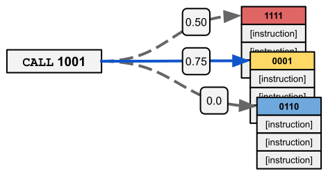

## Overview

<!-- TODO: This repository is the supplemental material associated with the following research article: ... -->

<!--  -->

**Navigation**

<!-- TOC -->

- [Overview](#overview)
  - [Abstract](#abstract)
  - [Tag-based Referencing](#tag-based-referencing)
  - [Tag-based Regulation](#tag-based-regulation)
  - [SignalGP](#signalgp)
    - [Genetic Regulation in SignalGP](#genetic-regulation-in-signalgp)
  - [Experiments](#experiments)
  - [Results](#results)
- [Reproducibility](#reproducibility)
- [Supplemental Material](#supplemental-material)
  - [Repository guide](#repository-guide)
- [References](#references)
- [Contributing authors](#contributing-authors)

<!-- /TOC -->

### Abstract

> **We introduce and experimentally demonstrate tag-based genetic regulation, a new genetic programming (GP) technique that allows evolving programs to regulate code modules.**
Tags are evolvable labels that provide a flexible mechanism for labeling and referring to code modules.
Tag-based genetic regulation extends existing tag-based naming schemes to allow programs to ''promote'' and ''repress'' code modules.
This extension allows evolution to form arbitrary gene regulatory networks in a program where genes are program modules and program instructions mediate regulation.
We demonstrate the functionality of tag-based genetic regulation on several diagnostic tasks as well as a more challenging program synthesis problem.
We find that tag-based regulation improves problem-solving performance on problems responses to particular inputs must change over time (e.g., based on local context).
We also observe that our implementation of tag-based genetic regulation can impede adaptive evolution when expected outputs are not context-dependent (i.e., the correct response to a particular input remains static over time).
Tag-based genetic regulation is immediately applicable to existing tag-enabled GP systems, and broadens our repertoire of techniques for evolving more dynamic programs.

### Tag-based Referencing

Tags are evolvable labels that can be mutated, and the similarity (or dissimilarity) between any two tags can be quantified.
Tags allow for _inexact_ addressing.
A referring tag targets the tagged entity (_e.g._, a module) with the _closest matching_ tag;
this ensures that all possible tags are potentially valid references.
Further, mutations to tags do not necessarily damage existing references.
For example, mutating a referring tag will have no phenotypic effect if those mutations do not change which target tag is matched.
As such, this technique allows the naming and use of modularized code fragments to incrementally co-evolve.

<!--  -->

  <figure>
    
  </figure>

In the tag-based referencing example above, the call instruction uses tag 1001 to reference the closest-matching module (in this case, the yellow module tagged 0001).

### Tag-based Regulation

Tag-based regulation allows evolving programs to instantiate gene regulatory networks using tag-based referencing.
This functionality allows programs to dynamically adjust which module is triggered by a particular call based on prior inputs.
Specifically, we implemented tag-based genetic regulation in the context of a linear GP system (SignalGP); however, our approach is applicable to any tag-enabled GP system.

To implement tag-based genetic regulation, we supplement the instruction set with promoter and repressor instructions that, when executed, adjust how well subsequent tag-based references match with a target module.
Intuitively, promoters increase a target module's tag-match score with subsequent references, thereby increasing its chances of being triggered; repressors have the opposite effect.
When determining which module to reference in response to a call instruction, each module's tag-match score is a function of how well the module's tag matches the call instruction's tag as well as the module's regulatory value.

### SignalGP

SignalGP defines a way of organizing and interpreting genetic programs to afford computational evolution access to the [event-driven programming paradigm](https://en.wikipedia.org/wiki/Event-driven_programming).
In SignalGP, program execution is signal-driven.
Programs are segmented into genetic modules (or functions), and each module can be independently triggered in response to a signal.
Each module associates a tag with a linear sequence of instructions.
In this work, tags are represented as fixed-length bit strings.

SignalGP makes the concept of events or signals explicit: all signals contain a tag and any associated
data.
Signals can originate exogenously (e.g, from the environment or other agents) or endogenously (e.g., self-signaling).
We use tag-based referencing (Spector et al., 2011) to determine the most appropriate function to automatically trigger in
response to a signal.
Signals trigger the function with the closest matching tag.

For a more detailed description of the SignalGP representation, see [(Lalejini and Ofria, 2018)](https://doi.org/10.1145/3205455.3205523).

#### Genetic Regulation in SignalGP

In this work, we augment the SignalGP representation with genetic regulation, allowing programs to alter their responses to signals during their lifetime.
We supplement the SignalGP instruction set with promotor and repressor instructions, which, when executed, adjust how well subsequent signals or internal call instructions match with a target function (instruction-level tags and tag-based referencing are used for function targeting).

A simple example of how genetic regulation works (in an event-handling context) is given in the figure below. First (1), an event triggers the yellow function that, when executed, (2) promotes the red function and represses itself. Finally (3), when a subsequent signal (identical to the previous) is received, it triggers the up-regulated red function instead of the yellow function.

### Experiments

We compared the performance of regulation-enabled and regulation-disabled SignalGP on five problems:

- Repeated-signal Problem
- Contextual-signal Problem
- Changing-signal Problem
- Boolean-logic Calculator Problem (prefix notation)
- Boolean-logic Calculator Problem (postfix notation)

The repeated-signal, contextual-signal, and prefix notation calculator problems each required programs to dynamically adjust their responses to particular inputs over time.
The changing-signal and postfix notation calculator problems did not require programs to adjust responses to inputs over time.

### Results

- Proof of method: we observed the evolution of programs capable of leveraging tag-based regulation to dynamically adjust module associations over time.
- We found that tag-based regulation improved problem-solving performance on context-dependent problems (i.e., problems in which the appropriate response to a particular input changes over time).
- We found that our implementation of tag-based regulation can impede adaptive evolution on problems that do not require programs to adjust responses to particular inputs over time.

## Reproducibility

The source code for our experiments is included in this repository (in the [source/](./source/) directory).
Our experiments are implemented in C++ using the [Empirical library](https://github.com/devosoft/Empirical) and an [external implementation of SignalGP](https://github.com/amlalejini/SignalGP).
We conducted our experiments using the high-performance computing resources providing by the [Institute for Cyber-Enabled Research](https://icer.msu.edu/) at Michigan State University.

We provide a step-by-step guide for compiling and running the software we used to run our experiments (including requisite dependencies): [./documents/running-experiments.md](./documents/running-experiments.md).

We conducted our data analyses using a combination of Python (version 3.8.6) and R (version 4.0.2).
Python is used primarily for data wrangling, and R is used for stats and graphs/visualizations.
See our [supplemental material](https://lalejini.com/Tag-based-Genetic-Regulation-for-LinearGP/supplemental/) for fully-detailed data analyses/visualizations (including source code)!

## Supplemental Material

In addition to our source code (found in this repository), we compiled our data analyses and supplemental documentation (including guides for replication and data availability) into a nifty web-hosted book using [bookdown](https://bookdown.org) and [GitHub pages](https://pages.github.com/).

:arrow_right: **[Find our supplemental material here](https://lalejini.com/Tag-based-Genetic-Regulation-for-LinearGP/supplemental/)** :arrow_left:

### Repository guide

- todo
- [media/](https://github.com/amlalejini/Tag-based-Genetic-Regulation-for-LinearGP/tree/master/media) contains images used throughout repository documentation.
- [scripts/](https://github.com/amlalejini/Tag-based-Genetic-Regulation-for-LinearGP/tree/master/scripts) contains several root-level utility scripts for data wrangling and for generating input/output examples for test-based problems. Note that experiment-specific scripts are located in their associated experiment directory.
- [source/](https://github.com/amlalejini/Tag-based-Genetic-Regulation-for-LinearGP/tree/master/source) contains the C++ implementations of our genetic programming experiments.

<!-- **Repository guide:**

- [./experiments/](https://github.com/amlalejini/ALife-2020--SignalGP-Genetic-Regulation/tree/master/experiments): contains experiment details for exploratory experiments and experiments described in the paper
  - [./experiments/alife-2020/analysis/](https://github.com/amlalejini/ALife-2020--SignalGP-Genetic-Regulation/tree/master/experiments/alife-2020/analysis/): contains data aggregation, processing, and analysis scripts for results in the paper
- [./media/](https://github.com/amlalejini/ALife-2020--SignalGP-Genetic-Regulation/tree/master/media/): contains images used throughout our supplemental material
- [./source/](https://github.com/amlalejini/ALife-2020--SignalGP-Genetic-Regulation/tree/master/source/): contains the source code for our diagnostic task experiments -->

## References

Lalejini, A., & Ofria, C. (2018). Evolving event-driven programs with SignalGP. Proceedings of the Genetic and Evolutionary Computation Conference on - GECCO ’18, 1135–1142. [https://doi.org/10.1145/3205455.3205523](https://doi.org/10.1145/3205455.3205523)

Spector, L., Martin, B., Harrington, K., & Helmuth, T. (2011). Tag-based modules in genetic programming. Proceedings of the 13th Annual Conference on Genetic and Evolutionary Computation - GECCO ’11, 1419. [https://doi.org/10.1145/2001576.2001767](https://doi.org/10.1145/2001576.2001767)

## Contributing authors

- [Alexander Lalejini](https://lalejini.com/)
- [Matthew Andrew Moreno](http://mmore500.com/)
- [Charles Ofria](https://ofria.com/)
