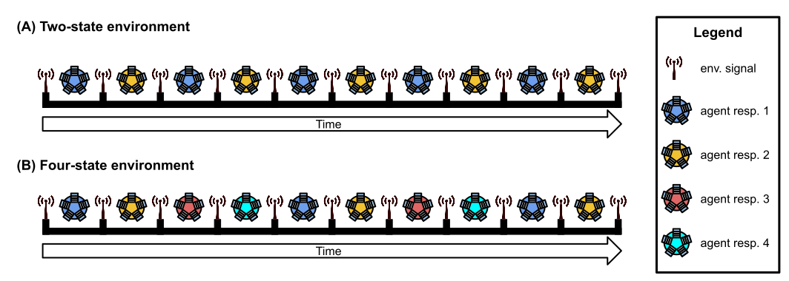
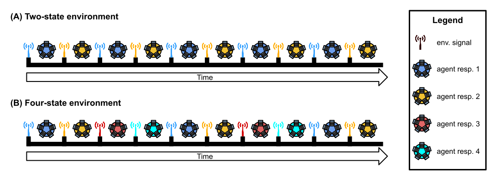
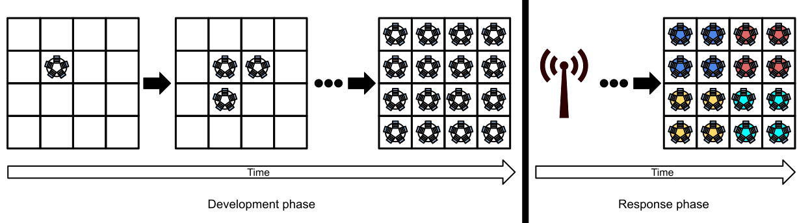

# Diagnostic Tasks

Here, we give a brief description of each of the diagnostic tasks used in this work.

**Navigation**
<!-- TOC -->

- [Repeated Signal Task](#repeated-signal-task)
  - [Experimental configuration](#experimental-configuration)
    - [General parameters](#general-parameters)
    - [Treatment-specific parameters](#treatment-specific-parameters)
- [Directional Signal Task](#directional-signal-task)
  - [Experimental configuration](#experimental-configuration-1)
- [Changing Signal Task](#changing-signal-task)
  - [Experimental configuration](#experimental-configuration-2)
    - [General parameters](#general-parameters-1)
    - [Treatment-specific parameters](#treatment-specific-parameters-1)
- [Multicellular Signal-differentiation Task](#multicellular-signal-differentiation-task)

<!-- /TOC -->

## Repeated Signal Task

The repeated signal task is one of several diagnostics we used to evaluate whether genetic regulation faculties contribute to, and potentially detract from, the functionality of evolved SignalGP digital organisms.
The repeated signal task requires organisms to exhibit signal-response plasticity; that is, they must shift their response to a repeated environmental signal during their lifetime.

The repeated signal task requires organisms to express the appropriate (distinct) response to a single environmental signal each of the _K_ times that it is repeated.
Organisms express responses by executing one of _K_ response instructions.
For example, if organisms receive four signals from the environment (i.e., _K_=4), a maximally fit organism will express `Response-1` after the first signal, `Response-2` after the second, `Response-3` after the third, and `Response-4` after the fourth.
The figure below depicts examples of optimal behavior in the repeated two- and four-signal tasks.

Requiring organisms to execute a distinct instruction for each repetition of the environmental signal represents organisms having to perform distinct behaviors.
Note that each repetition of the environmental signal is identical (i.e., each has an identical tag), and as such, organisms must track how many times the signal has been repeated and dynamically shift their responses accordingly.

We allowed organisms 128 time steps to express the appropriate response after receiving an environmental signal.
Once the allotted time to respond expires or the organism expresses any response, the organism's threads of execution are reset, resulting in a loss of all thread-local memory.
_Only_ the contents of an organism's global memory and each function's regulatory state persist. The environment then produces the next signal (identical to all previous environment signals) to which the organism may respond.
An organism must use their global memory buffer or genetic regulation to correctly shift its response to each subsequent environmental signal.
An organism's fitness is equal to the number of correct responses expressed during evaluation.

For each number of repeated signals (_K_ = 2, 4, 8, and 16), we ran 100 replicate populations (each with a distinct random number seed) of four experimental conditions:

1. a memory-only treatment where organisms must use global memory (in combination with procedural flow-control mechanisms) to correctly respond to environmental signals.
2. a regulation-augmented treatment where organisms have access to both global memory and genetic regulation.
3. a regulation-only control where organisms can adjust signal-responses through regulation.
4. a control where organisms can use neither global memory nor genetic regulation (which should make the repeated signal task impossible to solve; if we see solutions, something is not working as we expected...)

### Experimental configuration

Run-time parameters for the repeated signal task can be found in [../source/AltSignalConfig.h](https://github.com/amlalejini/ALife-2020--SignalGP-Genetic-Regulation/blob/master/source/AltSignalConfig.h).
Generate a configuration file by executing the the repeated signal task executable with the `--gen`
command line option.

#### General parameters

Parameters used across conditions.

| parameter | value | description |
| --- | --- | --- |
| matchbin_metric | streak | Compile-time parameter. Which tag-matching metric should be used for tag-based referencing?  |
| matchbin_thresh | 25 | Compile-time parameter. What is the minimum similarity threshold (as a percentage; e.g., 25 = 25% match) for tag-matches to succeed? |
| matchbin_regulator | mult | Compile-time parameter. Which tag-matching regulator should be used for genetic regulation? |
| TAG_LEN | 64 | Compile-time parameter. Number of bits in each tag bit string. |
| INST_TAG_CNT | 1 | Compile-time parameter. How many argument-tags does each instruction have? |
| INST_ARG_CNT | 3 | Compile-time parameter. How many numeric arguments does each instruction have? |
| FUNC_NUM_TAGS | 1 | Compile-time parameter. How many function-tags does each function have? |
| environment_signal_tag | Not a set-able parameter. Varied by replicate (randomly generated at the beginning of each run) | |
| SEED | varied by replicate | Random number generator seed |
| GENERATIONS | 10000 | How many generations should the population evolve? |
| POP_SIZE | 1000 | How many individuals are in our population? |
| NUM_ENV_CYCLES | 2, 4, 8, or 16 | How many times are signals repeated? |
| NUM_SIGNAL_RESPONSES | 2, 4, 8, or 16 | How many possible responses are there? |
| CPU_TIME_PER_ENV_CYCLE | 128 | How many time steps do programs have to respond after receiving an environmental signal? |
| MAX_ACTIVE_THREAD_CNT | 8 | How many threads are allowed to be running concurrently? |
| MAX_THREAD_CAPACITY | 16 | How many threads are allowed to be running concurrently + the number allowed to be in a pending state? |
| TOURNAMENT_SIZE | 8 | How many individuals participate in each tournament for parent selection? |
| MIN_FUNC_CNT | 0 | What is the minimum number of functions allowed in a program (constrains the mutation operators)? |
| MAX_FUNC_CNT | 128 | What is the maximum number of functions allowed in a program (constrains the mutation operators)? |
| MIN_FUNC_INST_CNT | 0 | What is the minimum number of instructions allowed in each program function? |
| MAX_FUNC_INST_CNT | 64 | What is the maximum number of instructions allowed in each program function? |
| INST_MIN_ARG_VAL | -8 | What is the minimum value for numeric instruction arguments? |
| INST_MAX_ARG_VAL | 8 | What is the maximum value for numeric instruction arguments? |
| MUT_RATE__FUNC_TAG_BF | 0.0005 | The per-bit mutation rate for function tags |
| MUT_RATE__INST_TAG_BF | 0.0005 | The per-bit mutation rate for instruction-argument tags |
| MUT_RATE__FUNC_DUP | 0.05 | The per-function mutation rate for whole-function duplications |
| MUT_RATE__FUNC_DEL | 0.05 | The per-function mutation rate for whole-function deletions |
| MUT_RATE__SEQ_SLIP | 0.05 | The per-function mutation rate for slip mutations (which can result in instruction-sequence duplications and deletions) |
| MUT_RATE__INST_INS | 0.005 | The per-instruction mutation rate for single-instruction insertions |
| MUT_RATE__INST_DEL | 0.005 | The per-instruction mutation rate for single-instruction deletions |
| MUT_RATE__INST_SUB | 0.005 | The per-instruction mutation rate for substitutions |
| MUT_RATE__INST_ARG_SUB | 0.005 | The per-instruction-argument rate for numeric argument substitutions |
| OUTPUT_DIR | output | What directory will the experiment write output? |
| STOP_ON_SOLUTION | 1 | Should we stop running (and output) as soon as a solution is found? |
| SNAPSHOT_RESOLUTION | 1000 | At what resolution (in generations) should we output 'snapshot' data? |
| SUMMARY_RESOLUTION | 100 | At what resolution (in generations) should we output summary data? |

#### Treatment-specific parameters

Parameters specific to particular experimental treatments.

**Regulation-augmented**

| parameter | value | description |
| --- | --- | --- |
| USE_GLOBAL_MEMORY | 1 | Do SignalGP digital organisms have access to global memory? |
| USE_FUNC_REGULATION | 1 | Do SignalGP digital organisms have access to genetic regulation? |

**Global-memory-only**

| parameter | value | description |
| --- | --- | --- |
| USE_GLOBAL_MEMORY | 1 | Do SignalGP digital organisms have access to global memory? |
| USE_FUNC_REGULATION | 0 | Do SignalGP digital organisms have access to genetic regulation? |

**Regulation-only**

| parameter | value | description |
| --- | --- | --- |
| USE_GLOBAL_MEMORY | 0 | Do SignalGP digital organisms have access to global memory? |
| USE_FUNC_REGULATION | 1 | Do SignalGP digital organisms have access to genetic regulation? |

**Neither global memory nor regulation**

| parameter | value | description |
| --- | --- | --- |
| USE_GLOBAL_MEMORY | 0 | Do SignalGP digital organisms have access to global memory? |
| USE_FUNC_REGULATION | 0 | Do SignalGP digital organisms have access to genetic regulation? |

## Directional Signal Task

The directional signal diagnostic task is a more challenging version of the repeated signal diagnostic.
The directional signal task requires organisms to not only track that the environment changed, but also
respond to _how_ the environment changed.
Specifically, we added a second environmental signal that shifts the required response backward to the
'previous' response.
For example, if response-three is currently required then a forward-signal would indicate that response-four
is required next, while a backward-signal would instead indicate that response-two is required next.
In contrast to the repeated signal task where there is one possible sequence of environmental transitions,
there are 2^_K_ possible environmental sequences where _K_ is the number of times the environment changes.
We expect that the simple regulation that evolves to solve the original repeated signal task will be
insufficient to cope with the branching nature of possible response sequences in the directional signal
task.

We use this task to explore whether more challenging tasks (the directional signal task)
promote the evolution of more complex regulatory networks than simpler tasks (the repeated signal
task).

We evolved 100 replicate populations of SignalGP digital organisms for 10000 generations on the directional
signal task where _K_ (the number of possible responses and the number of times the environment changes)
is equal to four. Thus, sixteen response sequences are possible.

### Experimental configuration

Run-time parameters for the directional signal task can be found in [../source/DirSignalConfig.h](https://github.com/amlalejini/ALife-2020--SignalGP-Genetic-Regulation/blob/master/source/DirSignalConfig.h).
Generate a configuration file by executing the the directional signal task executable with the `--gen`
command line option.

| parameter | value | description |
| --- | --- | --- |
| matchbin_metric | streak |  Compile-time parameter. Which tag-matching metric should be used for tag-based referencing?  |
| matchbin_thresh | 25 | Compile-time parameter. What is the minimum similarity threshold (as a percentage; e.g., 25 = 25% match) for tag-matches to succeed? |
| matchbin_regulator | mult | Compile-time parameter. Which tag-matching regulator should be used for genetic regulation? |
| TAG_LEN | 64 | Compile-time parameter. Number of bits in each tag bit string. |
| INST_TAG_CNT | 1 | Compile-time parameter. How many argument-tags does each instruction have? |
| INST_ARG_CNT | 3 | Compile-time parameter. How many numeric arguments does each instruction have? |
| FUNC_NUM_TAGS | 1 | Compile-time parameter. How many function-tags does each function have? |
| env_state_tags | Not a set-able parameter. Varied by replicate (randomly generated at beginning of run) | Defines the forward and backward environment signals. |
| SEED | varied by replicate | Random number generator seed |
| GENERATIONS | 10000 | How many generations should the population evolve? |
| POP_SIZE | 1000 | How many individuals are in our population? |
| NUM_ENV_UPDATES | 4 | How many times does the environment change (i.e., produce an environmental signal)? |
| NUM_ENV_STATES | 4 | How many possible responses are there? |
| CPU_CYCLES_PER_ENV_UPDATE | 128 | How many time steps do programs have to respond after receiving an environmental signal? |
| MAX_ACTIVE_THREAD_CNT | 8 | How many threads are allowed to be running concurrently? |
| MAX_THREAD_CAPACITY | 16 | How many threads are allowed to be running concurrently + the number allowed to be in a pending state? |
| USE_GLOBAL_MEMORY | 1 | Do SignalGP digital organisms have access to global memory? |
| USE_FUNC_REGULATION | 1 | Do SignalGP digital organisms have access to genetic regulation? |
| SELECTION_MODE | tournament | What selection scheme should we use to select parents to reproduce? |
| TOURNAMENT_SIZE | 8 | How many individuals participate in each tournament for parent selection? |
| EVAL_TRIAL_CNT | 1 | How many times should we independently evaluate each individual in the population (taking their minimum score)? |
| TEST_SAMPLE_SIZE | 16 | How many environment sequences (each unique) should we use to evaluate each organism? |
| MIN_FUNC_CNT | 0 | What is the minimum number of functions allowed in a program (constrains the mutation operators)? |
| MAX_FUNC_CNT | 128 | What is the maximum number of functions allowed in a program (constrains the mutation operators)? |
| MIN_FUNC_INST_CNT | 0 | What is the minimum number of instructions allowed in each program function? |
| MAX_FUNC_INST_CNT | 64 | What is the maximum number of instructions allowed in each program function? |
| INST_MIN_ARG_VAL | -8 | What is the minimum value for numeric instruction arguments? |
| INST_MAX_ARG_VAL | 8 | What is the maximum value for numeric instruction arguments? |
| MUT_RATE__FUNC_TAG_BF | 0.0005 | The per-bit mutation rate for function tags |
| MUT_RATE__INST_TAG_BF | 0.0005 | The per-bit mutation rate for instruction-argument tags |
| MUT_RATE__FUNC_DUP | 0.05 | The per-function mutation rate for whole-function duplications |
| MUT_RATE__FUNC_DEL | 0.05 | The per-function mutation rate for whole-function deletions |
| MUT_RATE__SEQ_SLIP | 0.05 | The per-function mutation rate for slip mutations (which can result in instruction-sequence duplications and deletions) |
| MUT_RATE__INST_INS | 0.005 | The per-instruction mutation rate for single-instruction insertions |
| MUT_RATE__INST_DEL | 0.005 | The per-instruction mutation rate for single-instruction deletions |
| MUT_RATE__INST_SUB | 0.005 | The per-instruction mutation rate for substitutions |
| MUT_RATE__INST_ARG_SUB | 0.005 | The per-instruction-argument rate for numeric argument substitutions |
| OUTPUT_DIR | output | What directory will the experiment write output? |
| STOP_ON_SOLUTION | 1 | Should we stop running (and output) as soon as a solution is found? |
| MINIMAL_TRACES | 0 | Should we output a minimal number of execution traces or traces for all possible environment sequences (watch out, this could be big!)? |
| SNAPSHOT_RESOLUTION | 1000 | At what resolution (in generations) should we output 'snapshot' data? |
| SUMMARY_RESOLUTION | 100 | At what resolution (in generations) should we output summary data? |
| SCREEN_RESOLUTION | 1 | At what resolution should we screen max-fitness organisms to check if they are a general solution? |

## Changing Signal Task

The changing signal task requires organisms to express a unique response for each of _K_ distinct environmental
signals (i.e., each signal has a distinct tag); the figure below is given as an example.
Because signals are distinct, organisms do not need to alter their responses to particular signals over
time.
Instead, organisms may 'hardware' each of the _K_ possible responses to the appropriate environmental
signal.
However, environmental signals are presented in a random order; thus, the correct _order_ of responses
will vary and cannot be hardcoded.
As in the repeated signal task, organisms respond by executing one of _K_ response instructions.
Otherwise, evaluation (and fitness assignment) on the changing signal task mirrors that of the repeated
signal task.

Requiring organisms to express a distinct instruction in response to each environmental signal represents
organisms having to perform distinct behaviors.

We allowed organisms 128 time steps to express the appropriate response after receiving an environmental
signal.
Once the allotted time to respond expires or the organism expresses any response, the organism's threads of execution are
reset, resulting in a loss of all thread-local memory.
_Only_ the contents of an organism's global memory and each function's regulatory state persist.
The environment then produces the next signal (distinct from all previous signals) to which the organism
may respond.
An organism's fitness is equal to the number of correct responses expressed during evaluation.

We evolved populations of 1000 SignalGP organisms to solve the changing signal task at _K_=16
(where _K_ denotes the number of environmental signals).
We evolved populations for 1000 generations or until an organism capable of achieving a perfect score
during task evaluation (i.e., able to express the appropriate response to each of the _K_ signals) evolved.

We ran 200 replicate populations (each with a distinct random number seed) of each of two experimental
conditions:

1. a regulation-augmented treatment where organisms have access to genetic regulation.
2. a regulation-disabled treatment where organisms do not have access to genetic regulation.

Note this task does not require organisms to shift their response to particular signals over time,
and as such, genetic regulation is unnecessary.
Further, because organisms experience environmental signals in a random order, erroneous genetic
regulation can manifest as cryptic variation.
For example, non-adaptive down-regulation of a particular response function may be neutral given one
sequence of environmental signals, but may be deleterious in another.

### Experimental configuration

Run-time parameters for the changing signal task can be found in [../source/ChgEnvConfig.h](https://github.com/amlalejini/ALife-2020--SignalGP-Genetic-Regulation/blob/master/source/ChgEnvConfig.h).
Generate a configuration file by executing the the changing signal task executable with the `--gen`
command line option.

#### General parameters

Parameters used across conditions.

| parameter | value | description |
| --- | --- | --- |
| matchbin_metric | streak |  Compile-time parameter. Which tag-matching metric should be used for tag-based referencing?  |
| matchbin_thresh | 25 | Compile-time parameter. What is the minimum similarity threshold (as a percentage; e.g., 25 = 25% match) for tag-matches to succeed? |
| matchbin_regulator | mult | Compile-time parameter. Which tag-matching regulator should be used for genetic regulation? |
| TAG_LEN | 64 | Compile-time parameter. Number of bits in each tag bit string. |
| INST_TAG_CNT | 1 | Compile-time parameter. How many argument-tags does each instruction have? |
| INST_ARG_CNT | 3 | Compile-time parameter. How many numeric arguments does each instruction have? |
| FUNC_NUM_TAGS | 1 | Compile-time parameter. How many function-tags does each function have? |
| env_state_tags | Not a set-able parameter. Varied by replicate (randomly generated at beginning of run) | Defines the forward and backward environment signals. |
| SEED | varied by replicate | Random number generator seed |
| GENERATIONS | 10000 | How many generations should the population evolve? |
| POP_SIZE | 1000 | How many individuals are in our population?How many times does the environment change (i.e., how many signals does the environment produce)? |
| NUM_ENV_UPDATES | 16 | How many times does the environment change (i.e., how many signals does the environment produce)? |
| NUM_ENV_STATES | 16 | How many possible responses are there? |
| CPU_CYCLES_PER_ENV_UPDATE | 128 | How many time steps do programs have to respond after receiving an environmental signal? |
| MAX_ACTIVE_THREAD_CNT | 8 | How many threads are allowed to be running concurrently? |
| MAX_THREAD_CAPACITY | 16 | How many threads are allowed to be running concurrently + the number allowed to be in a pending state? |
| TOURNAMENT_SIZE | 8 | How many individuals participate in each tournament for parent selection? |
| EVAL_TRIAL_CNT | 1 | How many times should we independently evaluate each individual in the population (taking their minimum score)? |
| MIN_FUNC_CNT | 0 | What is the minimum number of functions allowed in a program (constrains the mutation operators)? |
| MAX_FUNC_CNT | 128 | What is the maximum number of functions allowed in a program (constrains the mutation operators)? |
| MIN_FUNC_INST_CNT | 0 | What is the minimum number of instructions allowed in each program function? |
| MAX_FUNC_INST_CNT | 64 | What is the maximum number of instructions allowed in each program function? |
| INST_MIN_ARG_VAL | -8 | What is the minimum value for numeric instruction arguments? |
| INST_MAX_ARG_VAL | 8 | What is the maximum value for numeric instruction arguments? |
| MUT_RATE__FUNC_TAG_BF | 0.0005 | The per-bit mutation rate for function tags |
| MUT_RATE__INST_TAG_BF | 0.0005 | The per-bit mutation rate for instruction-argument tags |
| MUT_RATE__FUNC_DUP | 0.05 | The per-function mutation rate for whole-function duplications |
| MUT_RATE__FUNC_DEL | 0.05 | The per-function mutation rate for whole-function deletions |
| MUT_RATE__SEQ_SLIP | 0.05 | The per-function mutation rate for slip mutations (which can result in instruction-sequence duplications and deletions) |
| MUT_RATE__INST_INS | 0.005 | The per-instruction mutation rate for single-instruction insertions |
| MUT_RATE__INST_DEL | 0.005 | The per-instruction mutation rate for single-instruction deletions |
| MUT_RATE__INST_SUB | 0.005 | The per-instruction mutation rate for substitutions |
| MUT_RATE__INST_ARG_SUB | 0.005 | The per-instruction-argument rate for numeric argument substitutions |
| OUTPUT_DIR | output | What directory will the experiment write output? |
| STOP_ON_SOLUTION | 1 | Should we stop running (and output) as soon as a solution is found? |
| SNAPSHOT_RESOLUTION | 1000 | At what resolution (in generations) should we output 'snapshot' data? |
| SUMMARY_RESOLUTION | 100 | At what resolution (in generations) should we output summary data? |
| ANALYZE_ORG_EVAL_TRIALS | 5000 | How many samples of environment sequences should we use to test for generalization? |

#### Treatment-specific parameters

Parameters specific to particular experimental treatments.

**Regulation-augmented treatment**

| parameter | value | description |
| --- | --- | --- |
| USE_GLOBAL_MEMORY | 1 | Do SignalGP digital organisms have access to global memory? |
| USE_FUNC_REGULATION | 1 | Do SignalGP digital organisms have access to genetic regulation? |

**Regulation-disabled treatment**

| parameter | value | description |
| --- | --- | --- |
| USE_GLOBAL_MEMORY | 1 | Do SignalGP digital organisms have access to global memory? |
| USE_FUNC_REGULATION | 0 | Do SignalGP digital organisms have access to genetic regulation? |

## Multicellular Signal-differentiation Task

Note that this diagnostic task was cut from the final version of the paper.
As such, any analyses included in this repository are entirely exploratory.

In the multicellular signal differentiation task, a group of genetically homogeneous cells (demes)
must develop from a single propagule-cell and solve a simple signal-response differentiation task.
The figure below is given as an example.
Each deme is evaluated as a single individual, and the deme's fitness is based on how well cells
within the deme are able to differentiate their response to an environmental signal; further, we
reward demes for _clustering_ their response types.
For example, a deme with responses evenly distributed in space is less fit than a deme where all
like-responses are adjacent to one another (e.g., the figure below).

For this task, we evaluate demes in two distinct phases, each for a fixed number of time steps: a
development phase followed by a response phase.
At the beginning of the development phase, we initialize the deme with a single propagule SignalGP
cell.
During development, cells can self-replicate within their deme (without mutations), communicate with
neighbors, and differentiate.
Demes develop spatially on _W_ by _H_ toroidal grids.
After the time allotted for development expires, we place each cell in a dormant state where only the
contents of global memory and function regulation persist.
During the response phase of evaluation, we isolate each cell (i.e., it may not communicate or use sensors)
and record its response to an environmental signal.
All cells receive an identical signal (with the same tag); we give each cell a fixed number of time
steps to respond (or not) to the signal, and we record each cell's response.
There are _K_ possible responses, and cells express a response by executing one of _K_ response instructions.