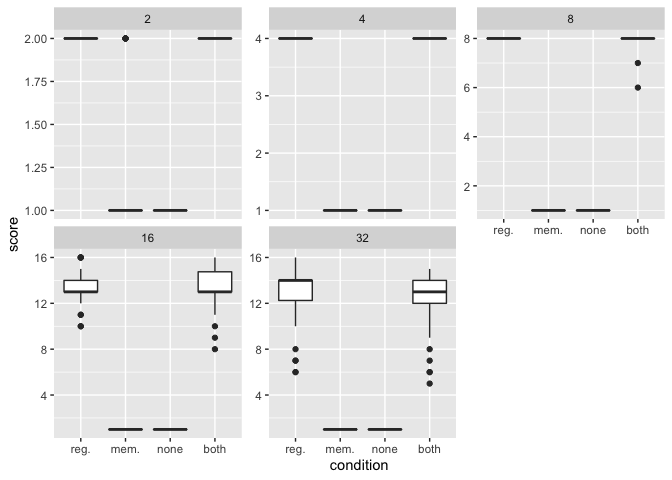
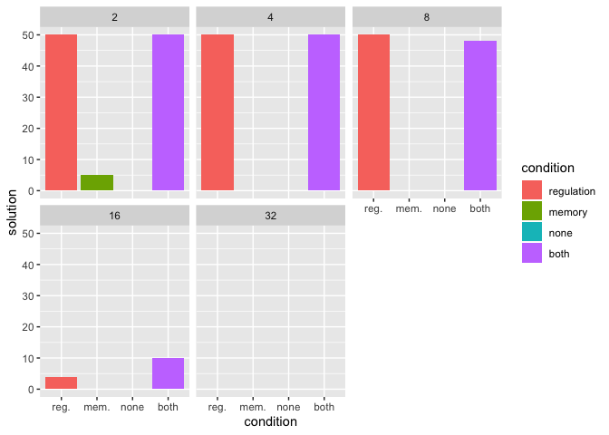

## Dependencies


```r
library(tidyr)    # (Wickham & Henry, 2018)
library(ggplot2)  # (Wickham, 2009)
library(plyr)     # (Wickham, 2011)
library(dplyr)    # (Wickham et al., 2018)
library(cowplot)  # (Wilke, 2018)
```


## Load and clean data


```r
data_loc <- "../data/alt_sig_max_fit.csv"
data <- read.csv(data_loc, na.strings="NONE")

data$matchbin_thresh <- factor(data$matchbin_thresh,
                                     levels=c(0, 25, 50, 75))
data$NUM_SIGNAL_RESPONSES <- factor(data$NUM_SIGNAL_RESPONSES,
                                     levels=c(2, 4, 8, 16, 32))

get_con <- function(reg, mem) {
  if (reg == "0" && mem == "0") {
    return("none")
  } else if (reg == "0" && mem=="1") {
    return("memory")
  } else if (reg=="1"&&mem=="0") {
    return("regulation")
  } else if (reg=="1"&&mem=="1") {
    return("both")
  } else {
    return("unknown")
  }
}
data$condition <- mapply(get_con, data$USE_FUNC_REGULATION, data$USE_GLOBAL_MEMORY)
data$condition <- factor(data$condition, levels=c("regulation", "memory", "none", "both"))
```

## Performance across environmental complexities

Task scores by environment & treatment

Note that:

- reg. = regulation-only condition
- mem. = global-memory-only condition
- none = access to neither regulation or global memory
- both = access to both regulation and global memory


```r
ggplot(data, aes(x=condition, y=score)) +
  geom_boxplot() +
  scale_x_discrete(breaks=c("regulation", "memory", "none", "both"),
                   labels=c("reg.", "mem.", "none", "both")) +
  facet_wrap(~ NUM_SIGNAL_RESPONSES, scales="free_y") +
  ggsave("dem-reg-alt-sig-scores.png", width=16, height=8)
```

<!-- -->

Task solution counts by environment & treatment


```r
ggplot(data, aes(x=condition, y=solution, fill=condition)) +
  geom_bar(stat="identity") +
  ylim(0, 50) +
  scale_x_discrete(breaks=c("regulation", "memory", "none", "both"),
                 labels=c("reg.", "mem.", "none", "both")) +
  facet_wrap(~ NUM_SIGNAL_RESPONSES) +
  ggsave("dem-reg-alt-sig-solutions.png", width=16, height=8)
```

<!-- -->

We can see that conditions with access to regulation outperform (produce more successful programs) conditions without access to regulation. The global-memory-only condition is only successful in the simplest environment (the two-signal environment).
