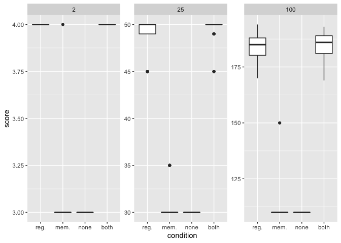

## Dependencies


```r
library(tidyr)    # (Wickham & Henry, 2018)
library(ggplot2)  # (Wickham, 2009)
library(plyr)     # (Wickham, 2011)
library(dplyr)    # (Wickham et al., 2018)
library(cowplot)  # (Wilke, 2018)
```

# Load data


```r
data_loc <- "../data/mc_reg_final_org.csv"
data <- read.csv(data_loc, na.strings="NONE")

data$matchbin_thresh <- factor(data$matchbin_thresh,
                                     levels=c(0, 25, 50, 75))
data$DEME_SIZE <- factor(data$DEME_SIZE,
                                     levels=c(2, 25, 100))

data$NUM_RESPONSE_TYPES <- factor(data$NUM_RESPONSE_TYPES,
                                     levels=c(2, 5, 10))

get_con <- function(reg, mem) {
  if (reg == "0" && mem == "0") {
    return("none")
  } else if (reg == "0" && mem=="1") {
    return("memory")
  } else if (reg=="1"&&mem=="0") {
    return("regulation")
  } else if (reg=="1"&&mem=="1") {
    return("both")
  } else {
    return("unknown")
  }
}
data$condition <- mapply(get_con, data$USE_FUNC_REGULATION, data$USE_GLOBAL_MEMORY)
data$condition <- factor(data$condition, levels=c("regulation", "memory", "none", "both"))
```

## Performance

Multicell scores by maximum multicell size and by SignalGP variant.

- reg. = regulation only (no global memory access)
- mem. = global memory access only (no regulation)
- both = both global memory access and regulation
- none = neighter global memory access nor regulation


```r
ggplot(filter(data), aes(x=condition, y=score)) +
  geom_boxplot() +
  scale_x_discrete(breaks=c("regulation", "memory", "none", "both"),
                   labels=c("reg.", "mem.", "none", "both")) +
  facet_wrap(~ DEME_SIZE, scales="free_y") +
  ggsave("dem-reg-mc-scores.png", width=16, height=8)
```

<!-- -->

For this, we can see that conditions with access to regulation fare much better than those without regulation.

For these runs, there was no selection pressure for the arrangement of responses. Multicells were categorized as a solution simply if (1) all cells in the multicell were active and (2) the cells collectively produced N of each of N types of responses. Thus, all cells needed to give a response and coordinate such that an equal number of each response was collectively expressed.


```r
ggplot(filter(data, EPIGENETIC_INHERITANCE=="0"), aes(x=condition, y=solution, fill=condition)) +
  geom_bar(stat="identity") +
  ylim(0, 50) +
  facet_wrap(~ DEME_SIZE) +
  scale_x_discrete(breaks=c("regulation", "memory", "none", "both"),
                 labels=c("reg.", "mem.", "none", "both")) +
  ggsave("dem-reg-mc-solutions.png", width=16, height=8)
```

<!-- -->

No replicates solve the 10x10 multicell task. The global memory-only condition only produces solutions in the 1x2 multicell size. Note that we only ran 30 replicates of each condition in the simplest multicell size (1x2), and we ran 50 replicates of each condition in the other two multicell sizes (5x5 and 10x10).
