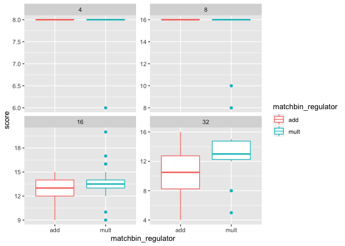
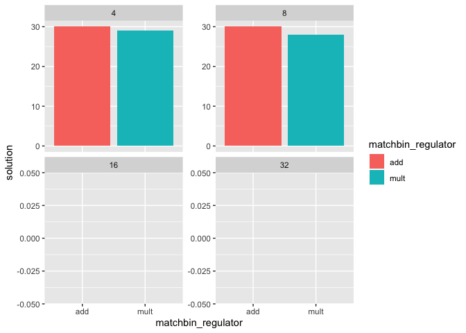

## Dependencies


```r
library(tidyr)    # (Wickham & Henry, 2018)
library(ggplot2)  # (Wickham, 2009)
library(plyr)     # (Wickham, 2011)
library(dplyr)    # (Wickham et al., 2018)
library(cowplot)  # (Wilke, 2018)
```

## Loading data


```r
data_loc <- "../data/max_fit_orgs.csv"
data <- read.csv(data_loc, na.strings="NONE")

data$matchbin_thresh <- factor(data$matchbin_thresh,
                                     levels=c(0, 25, 50, 75))
data$matchbin_regulator <- factor(data$matchbin_regulator,
                                     levels=c("add", "mult"))
data$NUM_SIGNAL_RESPONSES <- factor(data$NUM_SIGNAL_RESPONSES,
                                     levels=c(4, 8, 16, 32))
```

## Regulator performance

By score


```r
# SEED mbin_metric mbin_thresh NUM_SIGNAL_RESPONSES MUT_RATE__FUNC_TAG_BF score
ggplot(data, aes(x=matchbin_regulator, y=score, color=matchbin_regulator)) +
  geom_boxplot() +
  facet_wrap(~ NUM_SIGNAL_RESPONSES, scales="free_y")
```

<!-- -->

```r
  # ggsave("plot.pdf", width=16, height=8)
```


```r
# SEED mbin_metric mbin_thresh NUM_SIGNAL_RESPONSES MUT_RATE__FUNC_TAG_BF score
ggplot(data, aes(x=matchbin_regulator, y=solution, fill=matchbin_regulator)) +
  geom_bar(stat="identity") +
  facet_wrap(~ NUM_SIGNAL_RESPONSES, scales="free_y")
```

<!-- -->

```r
  # ggsave("plot.pdf", width=16, height=8)
```

For simpler environments (2 and 4), there is no difference in median score. Looking at solution counts reveals that the additive regulator was more successful (not statistically significant) in simpler environments.

For more complex environments, the multiplicative regulator _looks_ like it might be performing better on average.


```r
wilcox.test(formula=score ~ matchbin_regulator, data=filter(data, NUM_SIGNAL_RESPONSES==32), exact=FALSE, conf.int=TRUE)
```

```
## 
## 	Wilcoxon rank sum test with continuity correction
## 
## data:  score by matchbin_regulator
## W = 217.5, p-value = 0.000537
## alternative hypothesis: true location shift is not equal to 0
## 95 percent confidence interval:
##  -4.000002 -1.000037
## sample estimates:
## difference in location 
##              -2.999904
```

And a wilcoxon rank sum test shows that the difference (at 32 environment signals) in score is significant (in the favor of the multiplicative regulator). Thus, going forward, we'll use the multiplicative regulator over the additive regulator.

